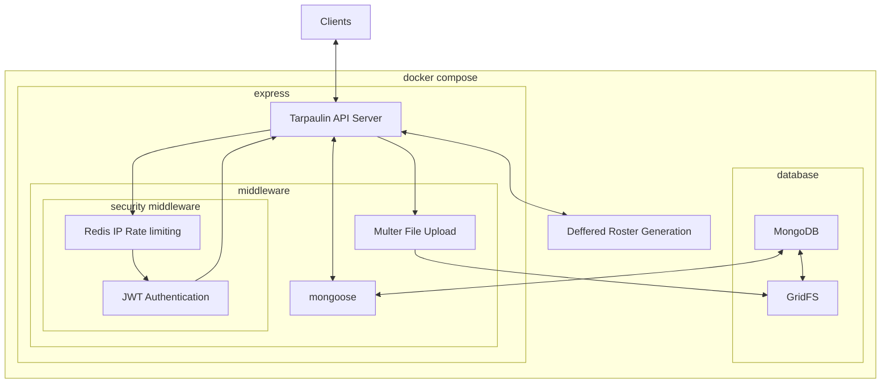

```mermaid
graph TD
    CLIENT[Clients]
    subgraph docker compose
        ROSTER[Deffered Roster Generation]
        subgraph database
            DB[MongoDB]
            FILE_DB[GridFS]
        end
        subgraph express
            subgraph middleware
                DB_WRAPPER[mongoose]
                UPLOAD[Multer File Upload]
                subgraph security middleware
                    IP_LIMIT[Redis IP Rate limiting]
                    AUTH[JWT Authentication]
                end
            end

            API[Tarpaulin API Server]
        end
    end

    
    CLIENT <--> API
    API --> IP_LIMIT
    IP_LIMIT --> AUTH
    AUTH --> API
    API <--> DB_WRAPPER
    DB <--> DB_WRAPPER
    DB <--> FILE_DB
    API --> UPLOAD
    UPLOAD --> FILE_DB
    API <--> ROSTER
```
