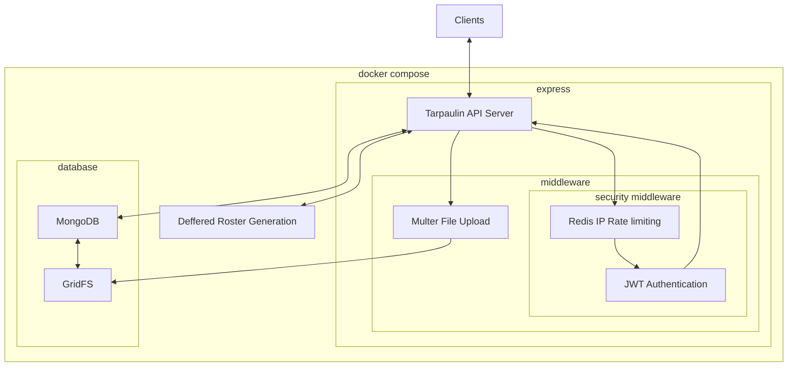

```mermaid
graph TB
    CLIENT[Clients]
    subgraph docker compose
        subgraph express
            API[Tarpaulin API Server]
            subgraph middleware
                subgraph security middleware
                    IP_LIMIT[Redis IP Rate limiting]
                    AUTH[JWT Authentication]
                end
                UPLOAD[Multer File Upload]
            end
        end 
        subgraph database
            DB[MongoDB]
            FILE_DB[GridFS]
        end
        ROSTER[Deffered Roster Generation]
    end

    
    CLIENT <--> API
    API --> IP_LIMIT
    IP_LIMIT --> AUTH
    AUTH --> API
    API <--> DB
    DB <--> FILE_DB
    API --> UPLOAD
    UPLOAD --> FILE_DB
    API <--> ROSTER
```